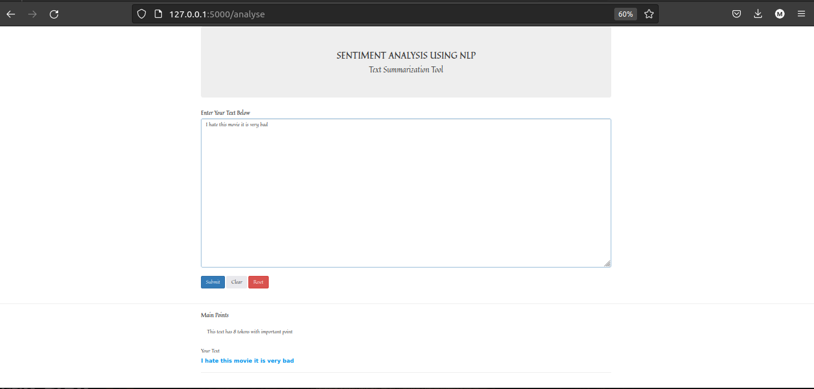
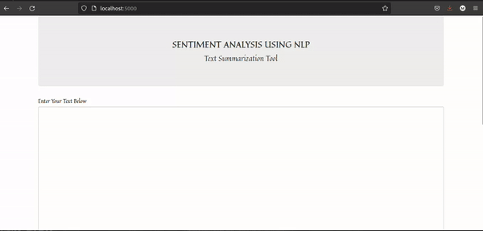

# End to end sentiment analysis

> In this project I used textblob library in Python and tried to do some analysis on the text provided.
I summerized the text, find out the sentiment and also point out the subjectivity of the text. I implemented a simple UI using HTML,CSS,JavaScript and also Flask as my API handling back end tool.

 

## Built With

- Python, HTML, CSS, JavaScript, jQuery
- Flask

## Getting Started

> git clone `https://github.com/Micky373/end_to_end_sentiment_analysis.git`

> cd end_to_end_sentiment_analysis

> pip install -r requirements.txt

> python app.py

> Then go and on the terminal put this link (http://localhost:5000/)

> Then put any text in the text area then click submit

> Then the result will be shown shortly

> More clear discription about how the textblob implementation in the sentiment analysis can be found in the notebooks folder. There is a notebook called sentiment_analysis.ipynb

## Author

- GitHub: [@GitHub](https://github.com/Micky373)

- LinkedIn: [LinkedIn](https://www.linkedin.com/in/michaeltamirie/)

## 🤝 Contributing

Contributions, issues, and feature requests are welcome!

Feel free to check the [issues page](https://github.com/Micky373/end_to_end_home_price_prediction_ml_project).

## Show your support

Give a ⭐️ if you like this project!

## Acknowledgments

- Special thanks to [Yaswanth Sai Palaghat](https://www.linkedin.com/in/yaswanthpalaghat/)
- The UI implementation and code flow done with the help of [this course](https://drive.google.com/file/d/1II_kbygRFMkYyNL-_vj7RK70r_ZJhG8a/view?usp=sharing)

## 📝 License

This project is [MIT](./MIT.md) licensed.